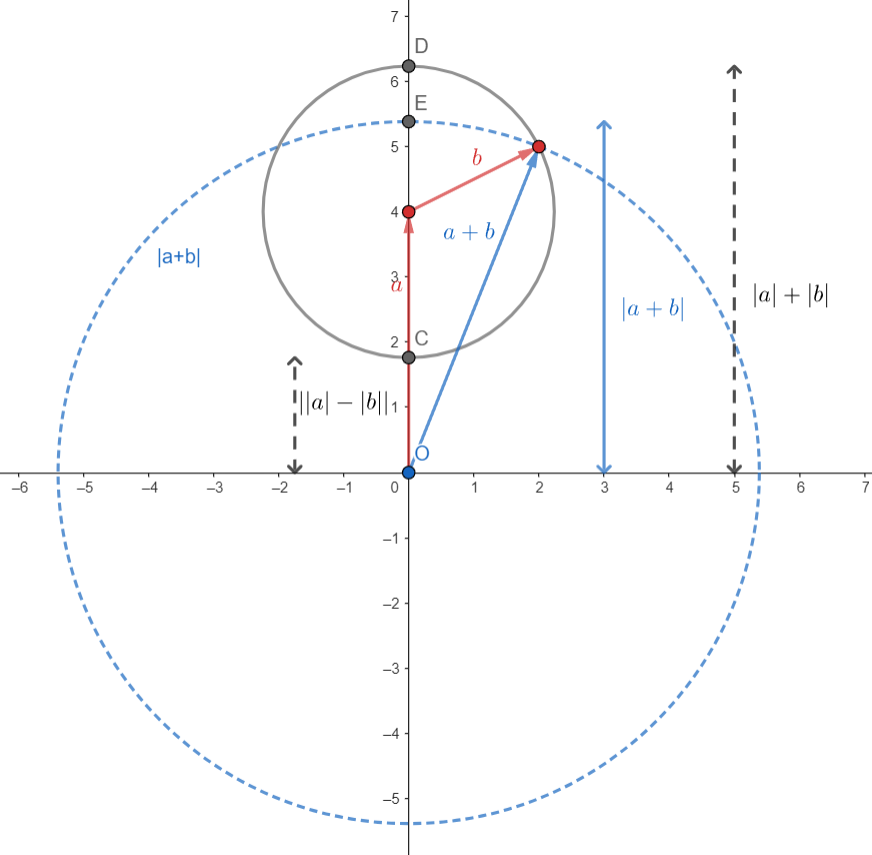

The triangle inequality is simple. But I can never quite remember the order in which the $<$ sign falls. It doesn't help there are up to 9 variants/corollaries, and neither a Google nor Wikipedia search shows all 9 variants in one place.

Without further ado:

$$
|a| - |b| \leq \left| |a| - |b| \right| \leq |a+b| \leq |a| + |b|
$$

$$
|a| - |b| \leq \left| |a| - |b| \right| \leq |a-b| \leq |a| + |b|
$$

All of this can be distilled into $|a+b| \leq |a| + |b|$, but I prefer seeing all these inequalities at once. 

### Example 1

Show

**Problem**. Show that $f(x) = |x|$ is continuous at $p \in \mathbb{R}$ using the $\varepsilon-\delta$ definition.

**Solution**. Assume $\varepsilon > 0$, $\delta > 0$, etc etc. 

We need to show that $||x| - |p|| < \varepsilon$. It suffices to show any of these: (moving right)

$$
|x - p| < \varepsilon
$$

$$
|x + p| < \varepsilon
$$

$$
|x| + |p| < \varepsilon
$$

We are given that $|x - p| < \delta$. Hence it follows all of these: (moving left)

$$
\begin{equation}
||x| - |p|| < \delta
\end{equation}
$$

$$
|x| - |p| < \delta
$$

Conveniently, $(1)$ gives us what we want, picking $\delta = \varepsilon$.

## Geometric

It would be remiss to write this article solely through an algebraic lens. I hope this visual proof is self-explanatory:

An interactive version is available in [geogebra](https://www.geogebra.org/calculator/qjgd9xp2?embed).

(drag around point B!)