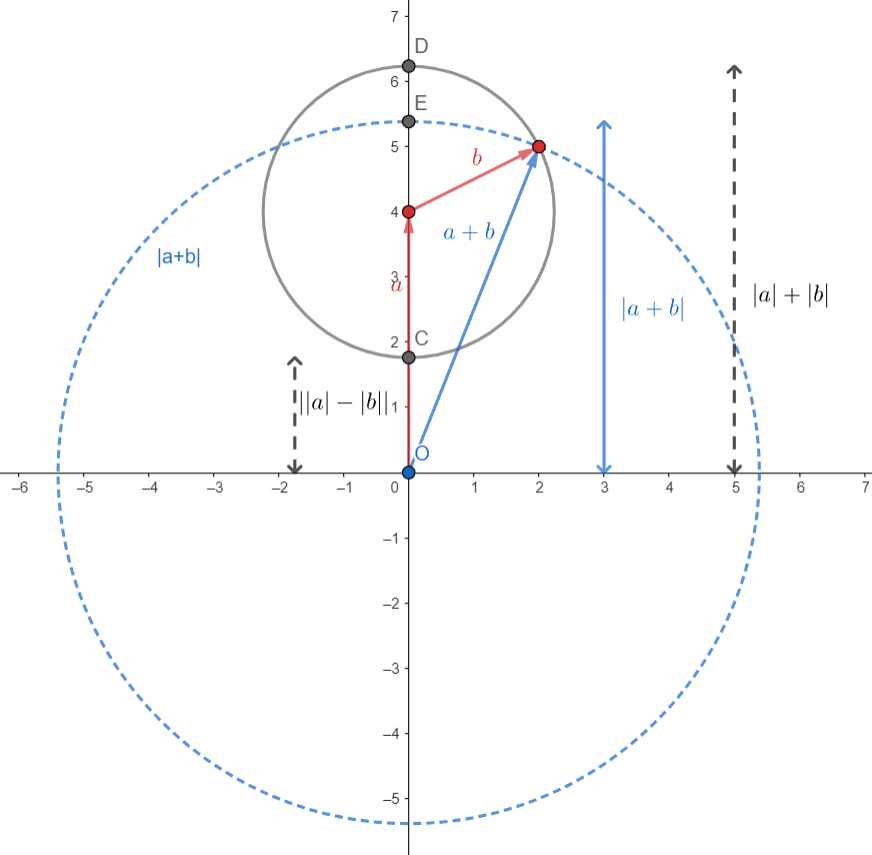

The triangle inequality is simple but yields many corollaries. The following concisely states it and its variants:

$$
|a| - |b| \leq | |a|-|b| | \leq
\left\{
\begin{array}{l}
|a+b| \\
|a-b|
\end{array}
\right\}
\leq |a| + |b|
$$

I find the above helpful when performing mindless manipulation of inequalities. For instance, if you wish to find an upper bound for the quantity $||a| - |b||$, you may check to see if proving an upper bound is accessible for any values to the right of $||a| - |b||$, such as $|a+b|$, $|a-b|$, or $|a| + |b|$.

## Geometric

It would be remiss to analyze the triangle inequality solely algebraically, so I made an visual proof with geogebra ([interactive!](https://www.geogebra.org/calculator/qjgd9xp2?embed)).

