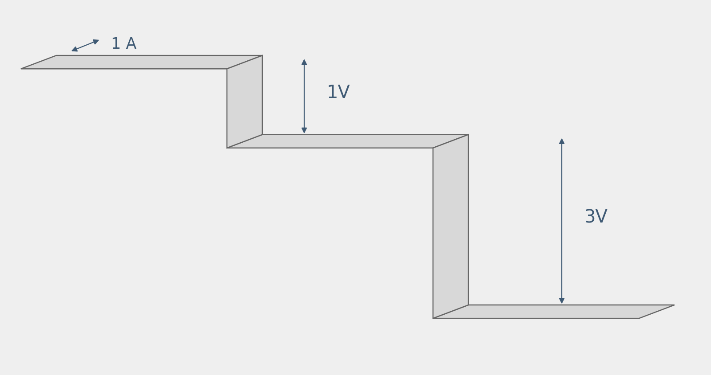

Nearly everyone has heard of the water analogy for electricity. Recently I surmised that my intuition depends on an even more basic analogy: the height/width analogy. 

I suspect that this concept is quite commonly understood and intuited, yet rarely enunciated.

# Definition

1. **Voltage** is **height**.
2. **Current** is **width**.

The voltage-height analogy is quite easy to justify. It is embedded in terminology such as voltage **drop**, **high** and **low** voltage, and **ground**. It has firm theoretical basis, as electric potential is very analogous to gravitational potential.

The current-width analogy is harder to justify. Current represents a flow rate (charge over time). There is precedent to thinking of flow as width: for example, [Sankey diagrams](https://en.wikipedia.org/wiki/Sankey_diagram) and highway lanes.

I imagine "width" to be the width of a river. Neglecting the river's depth, you would expect a river's width to be proportional to how much current passes through. 

The height/width analogy is rooted in the water analogy. But the appeal is that instead of worrying about pressure, depth, or flow rates, thinking about "width" is much simpler.

## Series and parallel

The analogy models series and parallel resistors very nicely.

### Series

I imagine a resistor as a waterfall with a certain height and width. If the resistors are placed in series, then each waterfall feeds into the other. For our system to make physical sense, the overall difference from beginning to end must be the sum of the heights of each waterfall. 

(That is, overall voltage drop equals the sum of voltage drops per resistor.)

Also, the width of each waterfall must be the same, since there is nowhere for the water to go (so the river can never become wider or narrower). 

(That is, the current is the same for each resistor.)

### Parallel

Supposing you have 3 resistors in parallel, I imagine a river diverging into 3 separate streams. Because the water always needs somewhere to go, I imagine that "width is preserved". That is, the width of the main river equals the sum of the widths of the streams. 

(That is, the overall current equals the sum of current through each resistor.)

Because the tops of each waterfall are connected (and hence level), and the bottoms of each waterfall are connected (and hence level), I would expect the difference in height to be the exact same among each waterfall. 

(That is, the voltage drop is the same for each resistor.)

## Kirchhoff's Circuit Laws

In the more general case we turn to Kirchhoff's circuit laws. Yet that is where the height/width analogy works the best!

### Kirchhoff's Voltage Law

If thinking of voltage as height: of course you have to get back to the height you started if walking around a loop!

When thinking of height, we have a natural intuition of what is physical and unphysical.

It is not like an M. C. Escher painting, where you can constantly climb in height yet return back to where you started:

We would expect that when walking in a loop, the net gain in elevation must be zero. That intuition translates nicely to Kirchhoff's Voltage Law.

### Kirchhoff's Current Law

When thinking about how rivers split, one reasonable assumption is that if a river splits into two child branches, the width of the original river is split among the children. 

That is the essence of Kirchhoff's Current Law: that current should be "balanced" where the current coming in equals the current coming out.

When thinking about width, that is quite reasonable: [Sankey diagrams](https://en.wikipedia.org/wiki/Sankey_diagram) and highway lanes are two other instances where when things split off, overall "width" is preserved.
